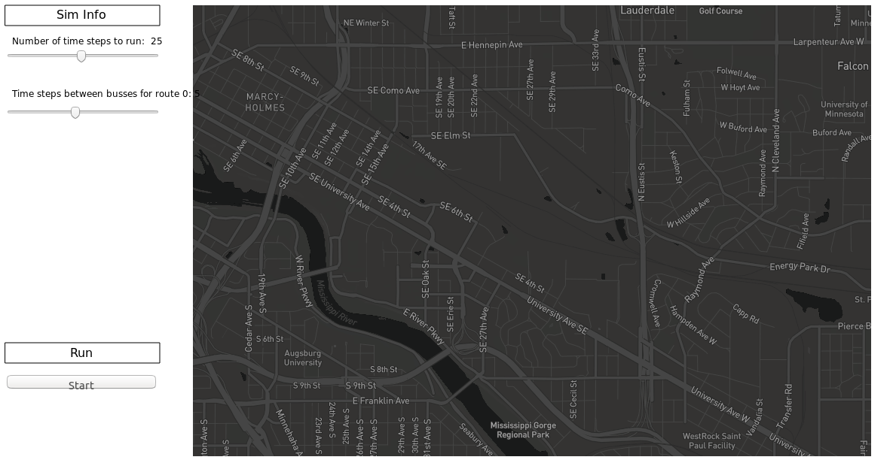

### Lab14: Makefile Refactoring for Preliminary Deliberable 2

The purpose of this lab is to lead you through the process of altering the makefile in the `project/src` directory so that when you navigate to `http://127.0.0.1:<port number>/web_graphics/project.html`, you will be able to view a visualization of your simulator. (Please refer to `project/README.md` for more information on running your simulator.)

This lab will help you complete the Iteration 2 Preliminary Deliverable 2, so you can successfully create an executable that runs your visual simulation. Recall that in Iteration 2, you will deliver 2 working simulations: the visual simulation and the configuration simulation. The objective of this lab is to get the _visual simulation_ working.

Once you have read through this lab and followed the instructions, you should be able to add the proper directives to your makefile in the `project/src` directory so that it can successfully create an executable that runs the configuration simulation. (Note: before the configuration simulation executable can be created successfully, _you will have to finish implementing it_ by completing the activities specified in the roadmap of comments embedded in the files that were released on Thursday, 11/14).


First, incorporate the newest and latest versions of the project files by pulling from the class `shared-upstream` repository into your `support-code` branch. Merge these changes into your `devel` branch then, navigate to the **project/src directory**. Once again, keep in mind Lab10, the advanced git lab, and ask yourself (or your neighbors!): "Should we be doing everything in devel?" :thinking:


Before beginning the lab, save a backup copy of your current src makefile (for example, copy the makefile into a file named makefile.bak).
Replace your old src makefile with the makefile provided in this lab. The lab will guide you through
what changes need to be made regarding the visual simulation. In addition to the changes made during
this lab, you should take any existing modifications to the makefile you made for Preliminary 1 (or otherwise)
and incorporate them back into this new makefile. In essence, we are creating a new makefile by "manually merging" this lab makefile, your previous src makefile, and additional directives for the visual simulation.

The visualization simulation relies on files in another directory that consist of C++ header and source code files that handle the web communication for the visualization. The configuration simulation will only require the files that can be found in the shared_upstream branch.

The path to the directory containing the C++ source files that implement the visualization functionality
is specified in a macro assigned in the makefile in the project/src directory. Open the makefile and locate the comment that says: **Path to web and library code**.  The value assigned to the macro named `CS3081DIR` contains the code necessary to build the visualizer. Using your terminal, navigate to that directory and have a look! Note that you will not be able to tab complete when you are inside `csci3081/` since students only have read permissions for the `project` directory. Type out (or just paste) the entire path into your terminal in order to step into the `project` directory.

Next, read through the makefile provided with the lab, _starting at the top and proceeding sequentially down to the bottom, one line at a time_. Follow the instructions in EACH of the comments that specify the need to  
create a macro or macros OR add/modify a directive already present in the makefile.

When you reach the comment mentioning the need for include directives which are necessary to create the executable for the visual simulation, cut and paste the following include directives:

```
-I$(CS3081DIR)/web  
-isystem$(CS3081DIR)/external/include  
-isystem$(CS3081DIR)/external/include/cppwebserver  
-isystem$(CS3081DIR)/external/include/gtest  
-isystem$(CS3081DIR)/external/include/websockets  
```

onto the end of the line. These need to be pasted either all on one line, one after another, or on separate lines with backslashes (`\`) to indicate that this is a multiline value. (See [this link](https://www.gnu.org/software/make/manual/html_node/Splitting-Lines.html#Splitting-Lines) for more on Splitting Long Lines and see [this link](https://www.gnu.org/software/make/manual/html_node/Splitting-Recipe-Lines.html) for more on Splitting Recipe Lines.)

**Don't stop at that point however**, keep going and making the changes specfied in the comments until you hit the end of the file. 

One note: Once you have the makefile working (it successfully attempts to compile your visual sim - and will succeed 
if you have added your structures correctly as specified by lab 13 (note, a new version of the `data_structures.h`
file in the structures was made available in shared-upstream AFTER lab 13, so you may have to update your code if you haven't already), your version of the visual simulation will compile.

While compiling the configuration simulation that you need to write for Prelim 2 has not been set up in this lab, your work on compiling the visualization simulation and changing the makefile in prelim 1 should be enough for you to understand how to get that compiling on your own. It will be limited to code in shared_upstream and will not require any code in the `web/` directory.

After completing the changes required, you should run your compiled `vis_sim` - the instructions for doing so are in the `project/README.md` file!

Optionally, once you have your makefile working, if you would like to cut down on the amount of output the makefile produces when it runs, you can add an `@` in front of each line similar to the lines below. This will tell the makefile to not output the command to the terminal.

```
@echo "=======...  
@$(call make...)  
@(echo "======...  
@$(CXX)$(OMP)...  
```

Happy Programming!!! :computer:



#### Common Problems / Additional notes
- the `web_interface` include issue will be fixed at the end of the lab (given you have completed the lab correctly)
- make sure to include `*.cpp` files that exist in `web/` --there is a `main.cpp` that is the "driver" behind running the local server for the visualization
- the `vis_sim` target needs to have _both_ the object files from your src code _and_ the object files from the web code
  - this should be reflected both in the list of `vis_sim` dependencies _and_ in the actual linking command itself
- if you are getting "multiple definitions" errors, remove the `$<` from the command --unlike `_test`, the `vis_sim` command should _not_ include the `$<`
- if you are getting `404 page not found` errors, despite having built the `vis_sim` executable, please refer back to the `project/README.md` and **carefully follow the steps to run the executable and view the webpage**. If your terminal has the following output, then the server has successfully started and _you should be able to view the webpage as shown above._
```
Usage: ./build/bin/ExampleServer <port number>
Using default config file: config.txt
starting server...
```
